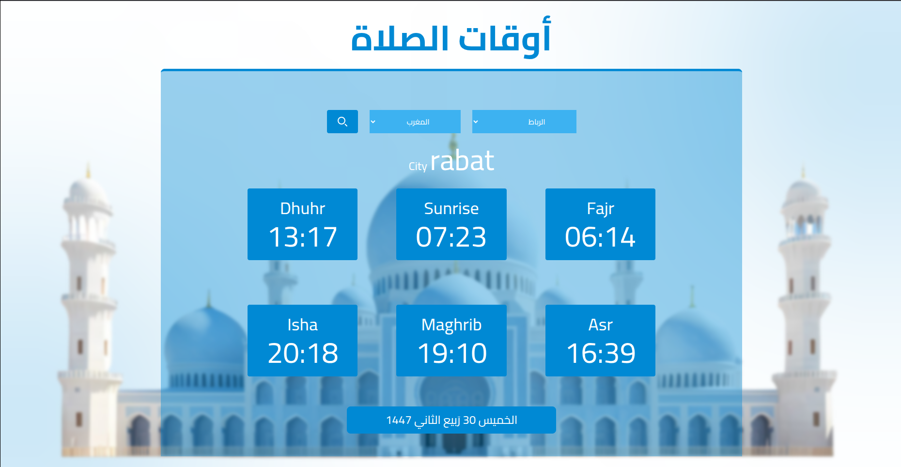

🕌 Prayer Time App

A simple web app that displays daily Islamic prayer times for any selected city and country.
Built with modern web technologies and styled using TailwindCSS.

🚀 Tech Stack

HTML – Structure

CSS – Styling basics

TailwindCSS – Utility-first CSS framework

JavaScript – Logic & functionality

Axios – For handling API requests

🌐 API Used

Aladhan API
 → Provides accurate prayer times by city & country.

✨ Features

Fetches prayer times dynamically from the API.

Displays main daily prayers (Fajr, Dhuhr, Asr, Maghrib, Isha, Sunrise).

Clean and responsive UI using TailwindCSS.

Easy to use, lightweight, and fast.

📸 Preview

📦 Installation & Usage

Clone the repository:

git clone https://github.com/AdamRharafi0027/prayer-time.git

Open the project folder.

Run the app by opening index.html in your browser.

🙏 Acknowledgements

Thanks to Aladhan
 for the free prayer time API.

Inspired by the need for quick access to daily prayer times.